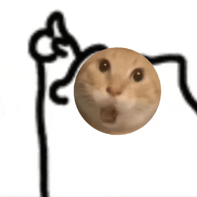

# Project HAKIMI: 混沌与救赎

## 🎮 项目简介

这是一个为"耄耋"迷因打造的沉浸式单页营销战役网站，结合像素风、故障艺术和游戏化互动，最终引导用户购买"九阳南北绿豆豆浆"实现"物理降火"。

## 📁 项目结构

```
journal-reader/
├── index.html              # 主页面（六大板块）
├── css/
│   └── style.css          # Maodiej-Core 视觉系统
├── js/
│   └── app.js             # 全栈交互逻辑
├── assets/                # 资产文件夹（需要用户准备）
│   ├── bg_main.gif        # 动态背景 - 耄耋注视
│   ├── product.png        # 产品图 - 九阳绿豆豆浆
│   ├── boss_idle.png      # Boss常态图
│   ├── boss_red_eye.png   # Boss红眼状态
│   ├── boss_hiss.png      # Boss哈气状态
│   ├── boss_ko.png        # Boss战败状态
│   ├── gallery_1.gif      # 梗图1
│   ├── gallery_2.jpg      # 梗图2
│   └── gallery_3.gif      # 梗图3
└── README_HAKIMI.md       # 本文档
```

## 🎨 视觉设计语言

### Maodiej-Core 色彩系统
- **#B5E61D (九阳绿)** - 解药、冷静、资本的诱惑
- **#FF0055 (故障粉)** - 迷因的狂热、攻击性、危险
- **#050505 (深空黑)** - 沉浸式暗黑背景

### UI 风格
- 像素风 (Pixel Art)
- 故障艺术 (Glitch Art)
- 赛博朋克美学

## 📦 必须准备的资产文件

### 1. 背景动态 GIF
- **文件名**: `assets/bg_main.gif`
- **用途**: 全屏低透明度背景，营造耄耋注视的压迫感
- **建议尺寸**: 1920x1080 或更高
- **风格**: 暗黑系、迷离、压迫感

### 2. 产品图
- **文件名**: `assets/product.png`
- **用途**: 九阳南北绿豆豆浆产品展示
- **建议**: 透明背景 PNG，高清晰度

### 3. Boss 状态图（4张）
- `assets/boss_idle.png` - 常态/舔毛
- `assets/boss_red_eye.png` - 眼睛发红光（重拳前摇）
- `assets/boss_hiss.png` - 身体后仰哈气（反击姿态）
- `assets/boss_ko.png` - 战败状态
- **建议尺寸**: 400x400 或更大，PNG 透明背景

### 4. 梗图库
- `assets/gallery_1.gif`
- `assets/gallery_2.jpg`
- `assets/gallery_3.gif`
- ...更多（可在 HTML 中添加）
- **用途**: 耄耋表情包、迷因图片
- **建议**: 各种尺寸的 GIF、JPG、PNG

## 🔗 必须替换的链接

### 在 `js/app.js` 文件中：

#### 1. 视频链接（第 6-10 行）
```javascript
const VIDEO_LINKS = {
    VIDEO_HACHIMI: 'https://www.youtube.com/embed/YOUR_VIDEO_ID_1',  // TODO: 替换
    VIDEO_CUTE: 'https://www.youtube.com/embed/YOUR_VIDEO_ID_2',     // TODO: 替换
    VIDEO_MAODIEJ: 'https://www.youtube.com/embed/YOUR_VIDEO_ID_3'   // TODO: 替换
};
```

#### 2. 购买链接（第 12 行）
```javascript
const PRODUCT_LINK = 'https://example.com/buy';  // TODO: 替换为实际购买链接
```

### 在 `index.html` 文件中：

搜索 `LINK_PRODUCT_BUY` 并替换为实际购买链接：
- 第二板块（救赎之地）的购买按钮
- 第六板块（真相）的终极购买按钮

## 🚀 部署步骤

### 方法 1: 简单本地测试
1. 确保所有文件和 assets 资产就位
2. 双击打开 `index.html` 即可在浏览器中查看

### 方法 2: 使用本地服务器（推荐）
```bash
# Python 3
python -m http.server 8000

# Node.js (需安装 http-server)
npx http-server

# 然后访问 http://localhost:8000
```

### 方法 3: 部署到 GitHub Pages
1. 创建 GitHub 仓库
2. 将所有文件推送到 `main` 分支
3. 在仓库设置中启用 GitHub Pages
4. 访问 `https://你的用户名.github.io/仓库名`

### 方法 4: 部署到 Netlify/Vercel
1. 将项目上传到 GitHub
2. 连接 Netlify 或 Vercel
3. 自动部署，获得 HTTPS 域名

### 方法 5: 传统服务器部署
1. 将整个项目文件夹上传到服务器
2. 配置 Nginx/Apache 指向项目根目录
3. 确保 `index.html` 为默认首页

## 🎯 六大板块功能

### 1. 创世纪：迷因演变
- 垂直时间轴展示 Hachimi → Cute Cat → Maodiej 演变
- 每个节点有"原典回溯"按钮，点击弹出视频

### 2. 救赎之地：绿豆产品
- 3D 悬浮产品展示
- 神圣光晕效果
- 醒目购买按钮

### 3. 模因档案馆：视觉库
- 瀑布流图库布局
- 鼠标悬停故障效果
- 点击查看大图

### 4. 资本游戏：A股操盘手
- **游戏机制**：
  - 初始资金 ¥100,000
  - 实时股价波动
  - 散户情绪系统
  - 随机事件卡（每 8-15 秒触发）
  - 玩家需在 3 秒内选择"加仓"或"跑路"
- **失败条件**：资金归零（爆仓）
- **失败惩罚**：强制弹窗 + 2秒后跳转购买页面

### 5. 决战耄耋：Boss战
- **游戏机制**：
  - 玩家血压 100 HP
  - Boss HP 1000
  - 怒气系统（集满 3 格释放终极技能）
  - Boss AI 前摇系统：
    - 🔴 红眼：下回合重拳（必须防御）
    - 💨 哈气：反击姿态（攻击会被反弹）
    - ✅ 舔毛：破绽时刻（全力攻击）
- **玩家技能**：攻击、防御、蓄力、嘲讽、绿豆净化
- **失败条件**：血压归零
- **失败惩罚**：屏幕碎裂效果 + 2秒后跳转购买页面

### 6. 真相：数据洞察
- 雷达图：乐子人 vs 消费者画像
- 柱状图：情绪传播路径
- 终极购买引导

## 📱 响应式设计

- ✅ 桌面端（1920x1080+）
- ✅ 平板端（768px - 1024px）
- ✅ 移动端（320px - 768px）
- 自适应导航栏
- 触摸优化

## 🎮 游戏平衡性

### A股操盘手难度调整
在 `js/app.js` 中修改：
- `this.money = 100000` - 初始资金
- `this.emotion = 50` - 散户情绪初始值
- 事件触发间隔：`8000 + Math.random() * 7000` (8-15秒)

### Boss战难度调整
- `this.bossMaxHP = 1000` - Boss 血量
- `this.playerMaxHP = 100` - 玩家血量
- 攻击伤害范围：`50 + Math.floor(Math.random() * 30)` (50-80)

## 🐛 故障排查

### 问题：图片不显示
- 检查 `assets/` 文件夹是否存在
- 检查文件名是否完全匹配（区分大小写）
- 使用浏览器开发者工具查看 404 错误

### 问题：视频无法播放
- 确保 YouTube 链接格式正确：`https://www.youtube.com/embed/视频ID`
- 检查视频是否允许嵌入

### 问题：游戏无法启动
- 打开浏览器控制台（F12）查看错误信息
- 确保 JavaScript 文件路径正确

### 问题：移动端显示异常
- 检查是否有 `<meta name="viewport">` 标签
- 使用 Chrome 开发者工具的设备模拟器测试

## 📊 性能优化建议

1. **图片优化**
   - GIF 文件建议压缩（使用 Gifsicle 或在线工具）
   - 背景 GIF 建议 < 5MB
   - 产品图使用 WebP 格式（向下兼容 PNG）

2. **加载优化**
   - 考虑添加 loading="lazy" 属性
   - 使用 CDN 托管静态资源

3. **代码优化**
   - 压缩 CSS/JS（使用 UglifyJS、CSSNano）
   - 启用 Gzip 压缩

## 🎨 自定义建议

### 添加更多梗图
在 `index.html` 的 `.gallery-container` 中添加：
```html
<div class="gallery-item" data-src="assets/gallery_4.gif">
    
    <div class="gallery-overlay">
        <span>查看原图</span>
    </div>
</div>
```

### 修改配色
在 `css/style.css` 的 `:root` 中修改：
```css
:root {
    --color-green: #你的颜色;
    --color-pink: #你的颜色;
    --color-black: #你的颜色;
}
```

### 添加背景音乐
在 `<body>` 末尾添加：
```html
<audio autoplay loop>
    <source src="assets/bgm.mp3" type="audio/mpeg">
</audio>
```

## 📄 许可证

本项目为营销战役创意项目，请遵守相关版权和使用规定。

## 🙏 致谢

- **设计风格**: Maodiej-Core 赛博朋克美学
- **游戏化设计**: 结合迷因文化与商业转化
- **技术栈**: 纯原生 HTML/CSS/JavaScript（无依赖）

## 📞 支持与反馈

如有问题或建议，请联系项目维护者。

---

**记住**：当你凝视耄耋时，耄耋也在凝视你。唯一的解药，是物理降火。🫘

---

## 快速检查清单

部署前请确认：

- [ ] 所有 assets 文件已准备
- [ ] 视频链接已替换（js/app.js）
- [ ] 购买链接已替换（js/app.js + index.html）
- [ ] 本地测试通过
- [ ] 移动端测试通过
- [ ] 所有图片加载正常
- [ ] 两个游戏运行正常
- [ ] 数据可视化正常显示

祝你的营销战役大获成功！🎉
